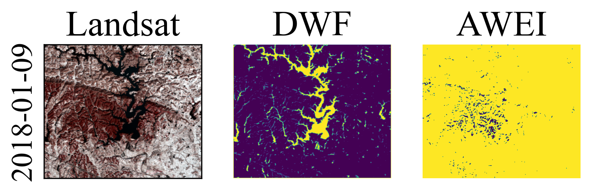
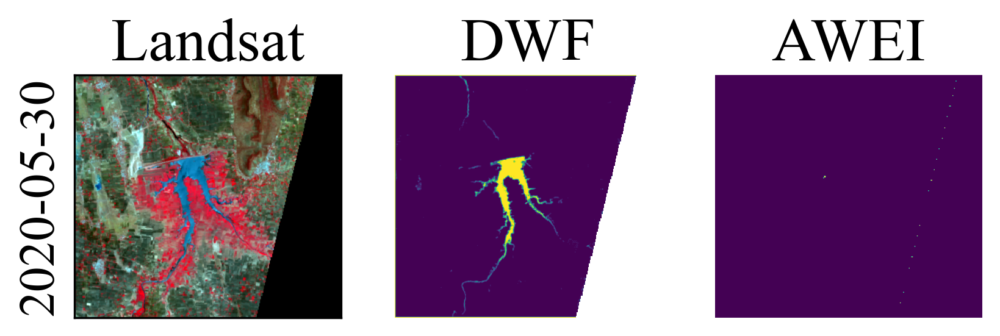

# DeepWaterFraction: Precision Estimation of Sub Pixel Scale Water Areas in Landsat Imagery

## Description

This repository contains code and pre-trained models for DeepWaterFraction, a self-training deep learning methodology that estimates surface water areas at a sub-pixel scale. The presented method provides significantly improved accuracy in detecting and estimating water bodies at fine scales, demonstrated by a pixel-wise root mean squared error for surface water area fraction of 14.8%. 

Specifically, our method reduces error rates by 52.7% for water bodies with a minimum area of 0.001 km² and by 22.3% for those with a minimum area of 0.01 km². Additionally, when applied to streamflow gauges and water level stations, the method significantly improved the correlation against observed streamflow and water level. The repository provides scripts for inferencing and visualizing the results of our model.

The pre-trained models and sample data associated with this research are hosted on Zenodo (links provided below). 




## Content of the Repository

- **main.py**: This is the main script which loads the data, applies the deep learning model, visualizes the results, and saves them.
- **dwf.py**: This script contains the implementation of the Deep Water Fraction (DWF) estimation model.
- **Pre-trained weights**: These are the weights of the model that have been pre-trained on our dataset. They are hosted on Zenodo: [https://zenodo.org/record/8133474].
- **swin_model**: This folder contains our modifications of the Swin Transformer classification model that we tested in our paper, though it is not chosen for the final application. The Swin Transformer model is a modified version of the model found at [https://github.com/JingyunLiang/SwinIR]. We extend our gratitude to the authors for their valuable contribution to the community. The call to this model can be found in the `main.py` file.

## Dependencies

This project uses several Python libraries. You can install them using pip:

```bash
pip install -r requirements.txt
```

## Usage 

To run the code, simply download the repository and run the **main.py** file. Note that this project requires a GPU to run, so make sure your environment is equipped with a compatible GPU.

## Future Work

This repository will be actively maintained and updated as we refine our model and expand our research. We welcome suggestions from the community. 

## Contact Information

If you encounter any issues or have any questions about the code or the research, please feel free to contact us at [zhen.hao18@alumni.imperial.ac.uk].

## Citation

If you find our work helpful in your research, please consider citing our paper:

```
[Under review]
```
